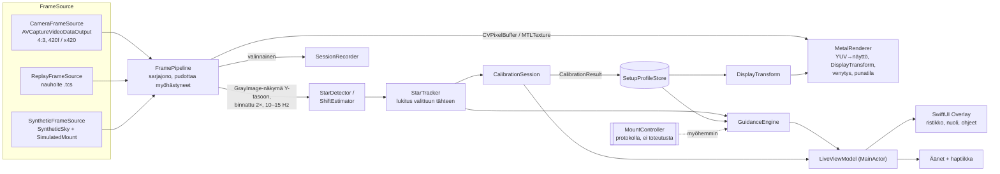
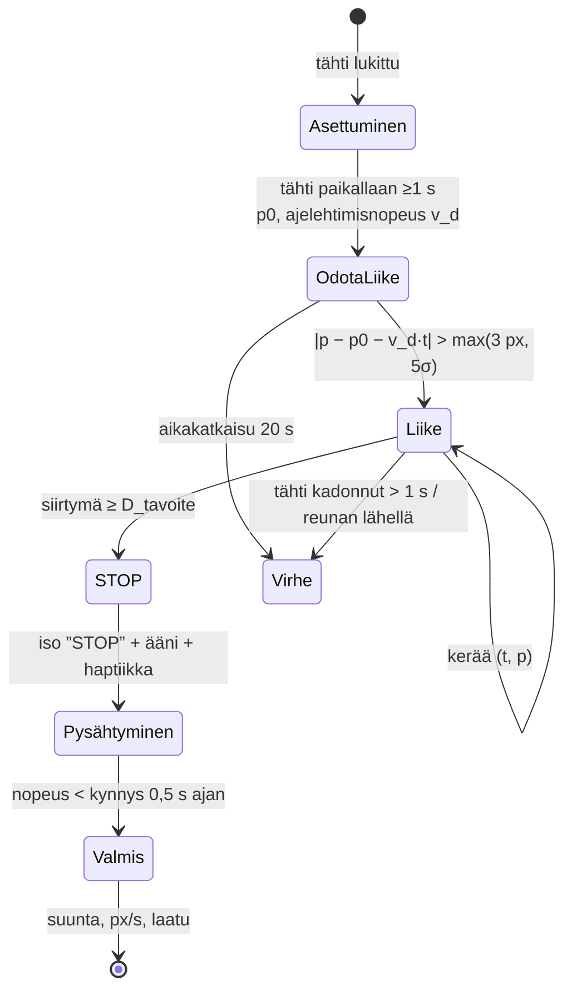
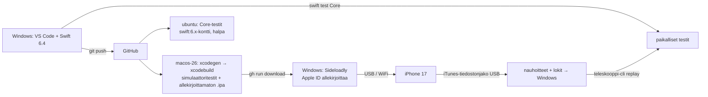
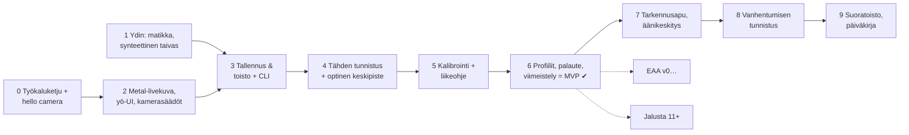

# Teleskooppikamera: suunnitelma

**Tila:** v1, 2026-09-29. Suunnitelma, ei vielä sovelluskoodia.
**Liittyvät:** [docs/brief.md](docs/brief.md) (lähtöohje), [decisions.md](decisions.md) (päätösloki, viitteet muotoa **D-nn**).

Merkinnät: ✅ pitää · ⚠️ pitää tarkennuksin · ❌ ei pidä · 🔬 mitataan laitteella.

---

## 0. Tiivistelmä

- **MVP:** livekuva Metalilla, yökäyttöliittymä, ristikko optiseen keskipisteeseen, kirkkaimman tähden seuranta ja **kahden liikkeen kalibrointi**. Kalibroinnin jälkeen ruutu kertoo tattisuunnan (`TATTI ↖`), ja näkymä on kierretty niin, että tatti ylös = ruutu ylös.
- **Kehitysketju ilman Macia:** puhdas Swift-ydin (`TeleskooppiCore`) käännetään ja testataan Windowsilla. iOS-sovellus käännetään GitHub Actionsin macOS-koneella ja asennetaan puhelimeen Sideloadlyllä (**D-02**, **D-03**).
- **Kehitys pilvisinä iltoina:** mukana alusta asti synteettinen taivas, simuloitu jalusta sekä tallennus ja toisto. Kalibrointia voi siis kehittää ja testata kokonaan ilman kaukoputkea, myös Windowsilla komentorivityökalulla.
- **Päivätestit:** kalibroinnin voi testata myös päivällä ilman tähteä, koska mukana on koko kuvan siirtymän estimaattori (**D-12**). Hämärässä mastojen punaiset lentoestevalot toimivat erinomaisina ”keinotähtinä”.
- **Aurinkoturvallisuus:** parvekkeen näkymä on luoteeseen, ja syys-lokakuussa aurinko laskee lähes suoraan länteen (atsimuutti noin 250–266°), siis näkymän reunaan. **Päivätestit siksi aamupäivällä.** Tarkemmin luvussa 8.

---

## 1. Lähtöoletusten arvio (brief kohta 3)

| # | Oletus | Arvio | Kommentti |
|---|---|---|---|
| 1 | Newton ei peilaa; takakamera ei peilaa → korjaus on kierto | ✅ | Kaksi heijastusta (pää- ja apupeili) tuottavat kierron eivätkä peilikuvaa. Takakameran puskuri ei ole peilattu (etukameran esikatselu on). **Tarkennus:** mittaa silti peilaus kalibroinnissa (determinantin etumerkki). Jos peilaus havaitaan, syy on lähes aina **SynScanin suuntien kääntöasetus** tai ohjaimen mappaus, ei optiikka. Silloin ”tatti = ruutu” ja ”kuten paljain silmin” eroavat toisistaan, ja sovellus kertoo sen käyttäjälle (luku 4.6). |
| 2 | Kiertokulma mielivaltainen | ✅ | Riippuu fokusserin asennosta, okulaarin kierrosta fokusserissa ja puhelimen kulmasta NexYZ:ssä. **Lisäys:** NexYZ tarttuu okulaariin, joten jos okulaari pääsee kiertymään fokusserin holkissa, koko kuva kiertyy. Kiristä fokusserin lukitusruuvi. Sovellus tunnistaa kiertymän myöhemmin itse (luku 9, ”kalibroinnin vanhentuminen”). |
| 3 | Viitekehys = jalustan akselit, ei taivas | ✅ | Kuva on sidottu putkeen, ja putken ”ylös” on aina korkeussuunta, joten kuvan suhde ALT/AZ-akseleihin on vakio. Taivaan pohjoinen kiertyy parallaktisen kulman mukana. MVP lupaa ”ALT ylös” / ”tatti ylös = ruutu ylös”. |
| 4 | Optinen keskipiste ≠ näytön keskipiste | ✅ | **Lisäys:** iPhonen näkökenttä on pystysuunnassa pienempi kuin okulaarin näennäinen kenttä (noin 50° vs. noin 52°), joten 16:9-kuvassa okulaarin ympyrä leikkautuu ylhäältä ja alhaalta. Käytetään 4:3-videoformaattia (**D-14**) ja sovitetaan ympyrä näkyviin kaarenosiin. |
| 5 | Kalibrointi kuten PHD2: 2×2-matriisi | ✅ | Toteutetaan juuri näin. **Tarkennus:** näyttöä varten matriisista johdetaan *ortogonaalinen* muunnos (kierto ± peilaus, Procrustes), ja liikeohje käyttää täyttä matriisia (**D-08**). Kuva ei vääristy, mutta ohje on silti tarkka. |
| 6 | Liike tulee moottoreista → tasainen | ✅ | Tasaisuus mahdollistaa suoran sovituksen liikeradan pisteisiin. **Tarkennus:** tatin Xbox-käytöstä SynScanissa selvitetään, onko se analoginen vai on/off ja kulkeeko vinottain. MVP ei oleta kumpaakaan. |
| 7 | Ohjaimen suunta ≠ jalustan akseli | ✅ | Siksi kalibrointi mittaa *tattisuuntien* vaikutuksen eikä akseleita. Käyttäjä vahvisti oletusmappauksen, joten peilausta ei odoteta. |
| 8 | Sovellus ei näe ohjainta eikä jalustaa | ✅ | Liikkeen alku ja loppu tunnistetaan kuvasta (luku 4.3). **Seuraus:** sovellus ei tiedä, millä nopeustasolla käyttäjä ajaa. Aika-arviot annetaan siksi aina ”kalibrointinopeudella”. |

**Puuttuvat oletukset, jotka vaikuttavat suunnitteluun:**

1. **Kännykän sisääntulopupilli rajaa aukkoa pienillä suurennoksilla.** iPhonen pääkameran pupilli on noin 3,7 mm (26 mm ekv., f/1,6, 🔬). 25 mm okulaarin ulostulopupilli on 5 mm, joten tehollinen aukko on noin 110 mm (noin 55 % valosta). Etsimiseen tämä ei haittaa. EAA:ssa 25 mm + 2× Barlow (ulostulopupilli 2,5 mm) tai 10 mm hyödyntää koko peilin.
2. **Käyttöliittymän suunta lukitaan.** Puhelin on okulaarissa mielivaltaisessa asennossa, joten iOS:n automaattinen kääntö sekoittaisi kaiken (**D-13**).
3. **Tatti ylös = ruutu ylös tarkoittaa puhelimen omaa ”ylös”-reunaa.** Jos puhelin on okulaarissa kyljellään, käyttäjä katsoo ruutua kallistetulla päällä. Tämä on luonnollista ja poistuu kokonaan iPad-suoratoistossa (luku 9).
4. **Kylmä ja lasi:** pääpeili ja okulaari huurtuvat, kun puhelimen lämpö tai hengitys osuu niihin. Pitkät sessiot vaativat lämmönhallintaa (luku 5).

---

## 2. MVP-rajaus

Briefin MVP on hyvä. Muutokset ja perustelut:

| Muutos | Perustelu |
|---|---|
| **+ Siirtymäestimaattori** (koko kuvan translaatio kehysten välillä) MVP:hen | Kalibroinnin voi testata päivällä rakennuksen kulmaa vasten ilman tähteä, kuten briefissä toivottiin. Sama komponentti palvelee myöhemmin EAA:n kohdistusta ja kalibroinnin vanhentumisen tunnistusta. Pieni, puhdas Swift-algoritmi. |
| **+ Tallennus ja toisto sekä synteettinen taivas** jo vaiheissa 1–3 | Brief pyytää tätä. Nostettu ennen tähden tunnistusta laitteella, jotta **ensimmäinen kirkas yö tuottaa jo testidataa**. |
| **+ Simuloitu jalusta + virtuaalitatti** (kehitysvalikko) | Koko kalibrointi- ja ohjaussilmukan voi ajaa sisällä puhelimella: synteettinen taivas liikkuu virtuaalitatin mukaan, ja mukana on välys ja ajelehtiminen. |
| **+ Aurinkomuistutus** (auringon atsimuutti ja korkeus ruudulla päivätesteissä, kiinteät Helsingin koordinaatit, ei sijaintilupaa) | Halpa ja konkreettinen turvallisuusapu. Automaattinen esto tulee vasta jalustaohjauksen myötä. |
| **+ Äänimerkki ja haptiikka kalibroinnin ”STOP”-hetkelle** | Katse on ohjaimessa. Brief mainitsee tämän jo; nostettu pakolliseksi. |
| **− Automaattinen ympyräntunnistus → ”vahva toive”** | Yöllä kaupunkitaivaalla okulaarin kenttäraja näkyy usein vain pitkällä valotuksella. **Napauttamalla asetettu keskipiste** on MVP:n varma perusta; automaattinen tunnistus tulee samassa vaiheessa mutta ei estä etenemistä. |
| **5.8 kamerasäädöt → osittain MVP:hen** | Valotuksen, ISOn ja tarkennuksen lukitus sekä ”ääretön” ovat välttämättömiä, koska ilman niitä automatiikka haeskelee tähtikuvassa. Digitaalinen zoom ja edistyneet säädöt MVP:n jälkeen. |
| **Äänikeskitys (peruutustutka) → heti MVP:n jälkeen** (vaihe 7) | Arvokas mutta ei välttämätön kalibroinnin todentamiseen. |

MVP:n määritelmä: **”Kalibroinnin jälkeen käyttäjä keskittää tähden 5/5 kertaa pelkkiä ruudun ohjeita seuraten, 25 mm ja 10 mm okulaarilla.”**

---

## 3. Arkkitehtuuri

### 3.1 Rakenne

```
Teleskooppikamera/
├─ Core/                        Swift Package: TeleskooppiCore (puhdas Swift, Windows + iOS)
│  ├─ Sources/TeleskooppiCore/
│  │   ├─ Geometry/             Vec2, Mat2, Affine2, kulmat, sovitukset (SVD 2×2, TLS-suora)
│  │   ├─ Imaging/              GrayImage (8/16/32f, stride), binning, tilastot
│  │   ├─ Detection/            StarDetector, StarTracker, FieldCircleDetector, ShiftEstimator
│  │   ├─ Calibration/          CalibrationSolver (matikka), CalibrationSession (tilakone)
│  │   ├─ Guidance/             GuidanceEngine, DisplayTransform
│  │   ├─ Profiles/             SetupProfile, EyepieceProfile (Codable)
│  │   ├─ Recording/            SessionFormat: SessionWriter / SessionReader
│  │   ├─ Simulation/           SyntheticSky, SimulatedMount
│  │   ├─ Astro/                SolarPosition (myöh. ParallacticAngle, koordinaatit)
│  │   └─ Mount/                MountController-protokolla (ei toteutusta MVP:ssä)
│  ├─ Sources/teleskooppi-cli/  Windows-työkalu: replay, simulate, export-pgm, calibrate
│  └─ Tests/TeleskooppiCoreTests/
├─ App/                         iOS-sovellus (vain CI:ssä käännettävä)
│  ├─ project.yml               XcodeGen-määrittely → .xcodeproj generoidaan CI:ssä
│  └─ Sources/
│      ├─ Camera/               CameraService, CameraFrameSource, CapabilityReport
│      ├─ Pipeline/             FramePipeline, FrameSource-protokolla, Replay/Synthetic-lähteet
│      ├─ Rendering/            MetalRenderer, Shaders.metal
│      ├─ Recording/            SessionRecorder (käyttää Core/SessionWriteria)
│      ├─ Storage/              SetupProfileStore
│      ├─ Feedback/             ToneGenerator (piippaus), Haptics
│      └─ UI/                   LiveScreen, Overlay, CalibrationFlow, Controls, Settings, DevMenu
├─ .github/workflows/           core-tests (Windows/Linux), ios-build (macOS → .ipa)
├─ docs/                        brief.md, device-iphone17.md (mittaukset), testiprotokollat
├─ plan.md, decisions.md, CLAUDE.md
```

**Sääntö (D-03):** `TeleskooppiCore` ei importtaa `AVFoundation`-, `Metal`-, `simd`-, `Accelerate`-, `CoreGraphics`- tai `UIKit`-kehyksiä, ainoastaan `Foundation`in. Silloin kaikki kalibroinnin, tunnistuksen ja ohjauksen logiikka on testattavissa Windowsilla ja komentorivillä nauhoitteita vastaan. Suorituskykykriittiset reitit (Metal-shaderit, vImage) ovat sovelluskerroksessa ja kutsuvat samoja rajapintoja.

### 3.2 Datavirta



### 3.3 Keskeiset rajapinnat (luonnos)

```swift
// Core — ei alustariippuvuuksia
public struct GrayImage { public let width, height, stride: Int; public let pixels: UnsafeBufferPointer<UInt8> /* tai omistava Data */ }
public struct FrameMeta: Codable { public var timestamp: Double; public var exposure: Double; public var iso: Float; public var lensPosition: Float }

public struct StarDetection { public var position: Vec2; public var flux: Double; public var peak: Double; public var snr: Double; public var hfr: Double; public var saturated: Bool }
public protocol StarDetecting { func detect(_ img: GrayImage, roi: Rect?) -> [StarDetection] }

public struct TrackSample { public var t: Double; public var p: Vec2; public var quality: Double }  // tähdestä TAI siirtymäestimaattorista

public struct CalibrationResult: Codable {
  public var stickToImage: Mat2        // M: sarakkeet = kuvasiirtymä px/s kalibrointinopeudella tattia OIKEA, YLÖS
  public var displayRotation: Double   // θ (rad)
  public var mirrored: Bool
  public var orthogonalityError: Double, repeatability: Double?
  public var opticalCenter: Vec2, fieldRadius: Double?
  public var createdAt: Date
}

public enum CalibrationPrompt { case centerStar, holdStill, pressAndHold(StickDir), stop, releaseAndWait, done(CalibrationResult), failed(CalibrationFailure) }
public final class CalibrationSession { public func feed(_ s: TrackSample?) -> CalibrationPrompt }

public struct GuidanceOutput { public var arrow: StickDir8?; public var continuousDir: Vec2; public var secondsAtCalRate: Vec2; public var withinTolerance: Bool }
public struct GuidanceEngine { public func guide(target: Vec2, center: Vec2, cal: CalibrationResult) -> GuidanceOutput }

public protocol MountController: AnyObject {  // MVP: vain rajapinta
  func move(alt: Double, az: Double) async throws   // nopeudet, °/s, etumerkillinen
  func stop() async throws
  var position: AsyncStream<MountPosition> { get }
}

// App
protocol FrameSource: AnyObject { var frames: AsyncStream<Frame> { get }; func start() async throws; func stop() }
```

### 3.4 Säikeistys ja suorituskyky

- Kameran takaisinkutsu tulee omalla sarjajonollaan (`alwaysDiscardsLateVideoFrames = true`). Renderöinti tehdään jokaiselle kehykselle `CVMetalTextureCache`n kautta ilman kopiointia.
- Tunnistus ajetaan erillisellä jonolla ≤ 15 Hz 2×-binnattuun Y-tasoon (960×720). Jos edellinen on kesken, kehys ohitetaan. CPU-tunnistus on tällä koolla muutamia millisekunteja (🔬 vaihe 4). Tarvittaessa binnaus ja taustan arvio siirretään Metal-laskentaan.
- UI-päivitykset menevät `@MainActor`-näkymämalliin ≤ 15 Hz. Swift 6:n tiukka rinnakkaisuustarkistus on käytössä alusta asti.

---

## 4. Kalibrointi ja liikeohje: tarkka suunnitelma

### 4.1 Koordinaatistot ja konventio

- **Kuvakoordinaatit** `p = (u, v)`: kameran puskuri **natiivissa (vaaka)asennossa**, u oikealle, v alas, pikseleinä (**D-05**). Kaikki mittaukset ja kalibrointi tehdään tässä kehyksessä.
- **Näyttökoordinaatit** `q = (x, y)`: x oikealle, y alas, näytön ”ylös” = puhelimen yläreuna UI:n lukitussa asennossa.
- **Tattivektori** `s = (s_R, s_U)`: s_R > 0 = tatti oikealle, s_U > 0 = tatti ylös. Yksikkö: sekuntia kalibrointinopeudella.
- **Fysiikka:** kun putki kääntyy ylös, kentän kohteet liukuvat kuvassa *alas*. Kun putki kääntyy oikealle, kohteet liukuvat *vasemmalle*.
- **Tavoitenäkymä (”ikkuna”):** tatti YLÖS → tähti liikkuu näytöllä suoraan ALAS, `e_U = (0, +1)`. Tatti OIKEALLE → tähti liikkuu suoraan VASEMMALLE, `e_R = (−1, 0)`. Silloin **tähti ristikon vasemmalla puolella → tatti vasemmalle** tuo tähden keskelle, ja ohjenuoli piirretään ristikosta kohti tähteä. Tämä on briefin konventio. Asetus ”käänteinen konventio” kääntää nuolen (**D-09**).

### 4.2 Malli

Pienillä liikkeillä tähden nopeus kuvassa on lineaarinen tattivektorin suhteen:

```
v_img = M · s ,   M = [ m_R  m_U ]   (2×2, sarakkeet px/s kalibrointinopeudella)
```

Mallissa on mukana kaikki tuntematon: kierto (fokusseri, NexYZ, okulaarin kierto), mahdollinen peilaus (SynScanin kääntöasetukset), mittakaava (okulaari ja nopeustaso) sekä atsimuuttiliikkeen `cos(ALT)`-kutistuminen, joka näkyy |m_R|:ssä mutta ei suunnassa.

### 4.3 Yhden kalibrointiliikkeen mittaus (tilakone)



- **Ajelehtiminen:** nopeus `v_d` estimoidaan paikallaanolon ajalta (≥ 1 s), ja se vähennetään kaikista näytteistä. Seurannan ollessa päällä `v_d ≈ 0`. Ilman seurantaa tähti ajelehtii ≤ 15″/s. Kalibrointinopeudella 16× suhteellinen virhe olisi ilman korjausta ≤ 6 %, korjauksella alle 1 %.
- **Välys:** ”kuollutta aikaa” ei mitata lainkaan, koska liike katsotaan alkaneeksi vasta, kun tähti on oikeasti lähtenyt liikkeelle. **Suunta saadaan liikeradan pisteisiin sovitetusta suorasta** (TLS, eli pääkomponentti) *liikkeen alun ja lopun välillä*. Suoran suunta orientoidaan alusta loppuun, ja nopeus = siirtymä / liikkeen kesto. Näin kiihdytys, välys ja jarrutus eivät vääristä suuntaa. Esiliikettä ei tarvita (**D-07**).
- **Tavoitesiirtymä:** `D_tavoite = 0,25 × kentän halkaisija`. Tämä on noin 380 px 4:3-kuvassa (1520 px ympyrä), joten 0,5 px:n sentroidivirhe antaa suuntaan alle 0,1°:n virheen.
- **Tähden lukitus:** alussa valitaan kirkkain tähti (tai käyttäjän napauttama), ja sitä seurataan ennustetun paikan ympärillä (portti = 3 × liike/kehys + 10 px). Hyppyä toiseen kirkkaaseen tähteen ei sallita.
- **Päivätila:** seurannan sijaan `ShiftEstimator` antaa koko kuvan translaation kumulatiivisesti. Tilakone on sama, koska syöte on sama `TrackSample`.

### 4.4 Matriisi, näytön kierto ja peilaus

Kaksi liikettä antaa mitatut nopeusvektorit `m_U` (tatti ylös) ja `m_R` (tatti oikealle) kuvakoordinaateissa. Silloin `M = [m_R m_U]`.

**Laatu:**
- Kohtisuoruus `φ = ∠(m_R, m_U)`. |φ − 90°| < 8° → OK, 8–15° → varoitus, > 15° → pyydä toisto. Alt-az-jalustalla akselien kuvat ovat paikallisesti kohtisuorassa, joten poikkeama kertoo mittausvirheestä, liian lyhyestä liikkeestä tai siitä, että käyttäjä painoi tattia vinoon.
- Suoran sovituksen jäännös (RMS kohtisuoraan suoraa vastaan) < 1,5 px.

**Peilaus:** tavoitematriisin `E = [e_R e_U] = [(−1,0) (0,1)]` determinantti on −1. Jos `sign(det M) = sign(det E)`, pelkkä kierto riittää. Muussa tapauksessa `mirrored = true`, ja ennen kiertoa tehdään vaakaflip `F = diag(−1, 1)` kuvakoordinaateissa.

**Kierto (Procrustes, D-08):** normalisoidaan `â_R = F^k m_R/|m_R|` ja `â_U = F^k m_U/|m_U|`. Etsitään `R(θ)`, joka minimoi `|R â_R − e_R|² + |R â_U − e_U|²`:

```
θ_R = atan2(e_R) − atan2(â_R) ,  θ_U = atan2(e_U) − atan2(â_U)
θ   = atan2( sin θ_R + sin θ_U ,  cos θ_R + cos θ_U )      // kulmien ympyräkeskiarvo
```

Tämä on 2D-Procrustes-ratkaisu, kun molemmilla vektoreilla on sama paino. Kiertokulma on mielivaltainen, ei 90°:n monikerta.

**Näytön muunnos** (kuva → näyttö), kun ristikko on näytön keskellä:

```
q = S · R(θ) · F^k · (p − c) + q_keskus
```

`c` on optinen keskipiste, ja `S` on skaalaus, joka valitaan niin, että okulaarin ympyrä täyttää näytön (”sovita” / ”täytä”). Muunnos toteutetaan 3×3-matriisina Metal-verteksishaderissa, ja SwiftUI-overlay käyttää samaa matriisia (**D-10**). Käsisäätö (kulma ja flipit) ohittaa kalibroinnin arvot ja näkyy UI:ssa merkinnällä ”KÄSI”.

**Bonus:** `|m_R| / |m_U| ≈ cos(ALT)` edellyttäen, että molemmat akselit ajetaan samalla nopeustasolla. Tästä saadaan karkea korkeusarvio ilmaiseksi. Näytetään vain kehitysvalikossa; se on epätarkka lähellä horisonttia.

### 4.5 Liikeohje

Tähti on paikassa `p`, ristikko paikassa `c`, ja virhe on `e = p − c` (kuva). Tavoitteena on siirtää tähteä `−e`:n verran:

```
M · s_tot = −e   ⇒   s_tot = −M⁻¹ · e        (s_tot = tattisekunnit kalibrointinopeudella)
```

- **Suunta:** `d = s_tot / |s_tot|`. Ideaalitapauksessa `d` osoittaa näytöllä ristikosta kohti tähteä (”ikkuna”). Tämä toteutuu täsmälleen, koska `R(θ)F^k` on juuri se muunnos, joka vie `M`:n sarakkeet `E`:ksi.
- **8-suuntainen nuoli** (←↑→↓↖↗↘↙): kvantisointi 45°:n sektoreihin ±5°:n hystereesillä, jotta nuoli ei värise rajalla. Vinottainen nuoli näytetään vain, jos pienempi komponentti on ≥ 0,4 s tai ≥ 25 % suuremmasta. Muuten näytetään vain pääakseli. Näin ohje on ”tee ensin tämä” eikä vaadi tarkkaa vinoliikettä.
- **Aika-arvio:** `|s_R|` ja `|s_U|` sekunteina kalibrointinopeudella, esim. `TATTI ← ~3 s`. Sovellus ei tiedä nykyistä nopeustasoa, joten teksti on pieni ja toissijainen.
- **Toleranssi:** sisäsäde `r_ok` (oletus 3 % kentän halkaisijasta ≈ 45 px, profiilikohtainen). Kun tähti on säteen sisällä, nuoli häviää ja ristikko vaihtuu ”OK”-tilaan. Ohje palaa vasta, kun `|e| > 1,5·r_ok` (hystereesi).
- **Ilman tähteä:** ristikon ympärillä näytetään neljä himmeää akselimerkkiä (`↑` jne.) kalibroituihin suuntiin. Ne ovat näytöllä aina akselien suuntaiset, mikä on hyvä tarkistus kalibroinnin järkevyydelle.
- **Nopeus- ja kosinikorjaus:** `M⁻¹` käyttää mitattuja sarakkeita, joten jos kalibrointi on tehty eri korkeudella kuin nykyinen, AZ-aika-arvio on väärä kertoimella `cos ALT_nyt / cos ALT_kal`. Suunta pysyy lähes oikeana. MVP hyväksyy tämän; jalustayhteyden myötä korjataan tarkasti.

### 4.6 Kalibroinnin kulku (käyttäjän näkökulma)

1. **Valmistelu** (ohje ruudulla): SynScanissa seuranta päälle ja nopeustaso niin, että 25 %:n siirtymä kestää 3–7 s. SynScanin tasot (V): 2 = 8×, 3 = 16×, 4 = 32×, 5 = 64× (oletus), 6 = 128× (1× = 15″/s). **Suositus: 25 mm → taso 3–4** (25 % ≈ 0,43° → 6,4 s / 3,2 s), **10 mm → taso 2–3** (0,17° → 5,2 s / 2,6 s). Oletustaso 5 on kalibrointiin liian nopea. Kirkas tähti lähelle ristikkoa. Tatti on SynScanissa vasen tatti, ja nopeustaso vaihdetaan oikean tatin vasen/oikea-suunnalla (V).
   - 🔬 **Tarkistettava vaiheessa 2:** onko vasen tatti analoginen vai on/off, ja liikkuuko jalusta vinottain. Jos vino liike ei onnistu, liikeohje näyttää vain akselinuolet (asetus kytkeytyy pois automaattisesti).
2. **Kalibroi** (iso nappi, tai AVCaptureEventInteraction: äänenvoimakkuusnappi tai Bluetooth-laukaisin, **D-18**). Sovellus lukitsee tähden ja odottaa, että se on paikallaan (≥ 1 s).
3. **”Pidä tattia YLÖS”.** Kun tähti on liikkunut 25 %: **STOP** (koko ruudun välähdys, piippaus, haptiikka) → ”Päästä irti”.
4. **”Pidä tattia OIKEALLE”** → STOP.
5. **Tulos:** kulma θ, peilaus, kohtisuoruus ja laatuindikaattori (vihreä/keltainen/punainen). Näkymä kääntyy animoiden uuteen asentoon (”tatti ylös = ruutu ylös”).
   - Jos `mirrored = true`: ilmoitus *”Kuva on peilattu. Tarkista SynScanin suuntien kääntöasetukset. Tatti ja ruutu täsmäävät, mutta kuva ei vastaa taivasta paljain silmin.”*
6. **Tarkistus** (valinnainen, suositeltu ensimmäisillä kerroilla): ”Palauta tähti ristikkoon ohjeiden mukaan”. Tähti on nyt noin 0,7 säteen päässä, joten tämä on samalla ensimmäinen oikea testi. Mitataan aika ja se, liikkuiko tähti ennustettuun suuntaan (kulmavirhe).
7. Tulos tallennetaan setup-profiiliin (okulaari + adapterin asento). Aloitusruudulla on valinnat **”Käytä edellistä”** ja **”Kalibroi uudelleen”**.

**Pikakalibrointi (1 liike, D-06):** kun profiilissa on jo täysi kalibrointi (peilaustieto ja akselien suhde) ja vain puhelimen kulma NexYZ:ssä on muuttunut, riittää ”tatti YLÖS”. θ päivitetään, ja `m_R` johdetaan kiertämällä `m_U`:ta 90° profiilin peilaustiedon mukaisesti.

### 4.7 Yksi vai kaksi liikettä? Päätös: kaksi (D-06)

Newtonin peilauksettomuuden ansiosta yksi liike riittäisi *periaatteessa* kiertokulmaan. Se ei kuitenkaan havaitse toisen akselin kääntöä (SynScanin asetus tai ohjaimen mappaus), ei anna laatumittaria (kohtisuoruus) eikä erillistä AZ-nopeutta. Toinen liike kestää noin 5 s lisää. **Kaksi liikettä oletuksena; yksi liike pikakalibrointina tunnetulle kokoonpanolle.**

### 4.8 Testattavuus (Windows)

- `SimulatedMount` + `SyntheticSky` muodostavat suljetun silmukan. Parametrit: tuntematon kierto (0–360°), peilaus kyllä/ei, välys (0–15′), ajelehtiminen (0–15″/s), seeing-värinä (σ 0,5–3 px), kohina, satunnaiset ”pilvi”-katkot, kiihdytysrampit ja vinosti painettu tatti (±10°).
- **Hyväksyntä yksikkötesteissä:** kiertokulman virhe < 1° (p95) ja peilaus oikein 100 % (1000 satunnaistapausta). Liikeohjeen suunta on ”ristikosta kohti tähteä” ±2° kaikilla kulmilla. Kaikki vikatilat (tähti katoaa, liike liian lyhyt, vino painallus) antavat oikean virheilmoituksen.

### 4.9 Tähden tunnistus (MVP:n ainoa kuva-analyysi)

1. Y-taso binnataan 2× → 960×720, ja tulos maskataan okulaarin ympyrään.
2. Tausta arvioidaan 32×32-lohkojen mediaaneista ja interpoloidaan bilineaarisesti. Näin kaupunkitaivaan gradientti ja okulaarin reunan vinjetointi poistuvat. Kohina σ saadaan MAD:sta.
3. Kynnystys `tausta + k·σ` (k = 5). Yhtenäiset alueet haetaan 8-naapuruudella. Yhden pikselin alueet hylätään (kuumat pikselit).
4. Sentroidi lasketaan taustavähennetyn intensiteetin painopisteenä 2·HFR-ikkunassa (iteroidaan 2×). Samalla lasketaan HFR, joka on pohja tarkennusavulle.
5. Kirkkaus lasketaan fluxina eikä huippuarvona, koska kylläiset tähdet on litistetty. Kylläisyydestä annetaan lippu.
6. Päivällä ja hämärässä sama detektori tunnistaa lentoestevalon. Täyspäivällä käytetään `ShiftEstimator`ia: 4×-binnattu kuva, normalisoitu ristikorrelaatio karkeasta tarkkaan ja alipikselitarkennus paraabelisovituksella.

---

## 5. iOS-kamerarajapinnat, iPhone 17

Luotettavuus: **V** = varmistettu lähteestä, **T** = todennäköinen (päätelty aiemmista malleista), **🔬** = mitataan vaiheessa 0. Lähteet ja mittauskoodi: [docs/device-iphone17.md](docs/device-iphone17.md).

### 5.1 Laitteisto

| | Arvo | |
|---|---|---|
| `builtInWideAngleCamera` | 48 MP Fusion, 26 mm ekv., ƒ/1,6, 1/1,56″ (≈ 8,1 × 6,0 mm), 1,0 µm (binnattuna 2,0 µm), sensorin siirto-OIS | V |
| ”2×-tele” | pääkennon keskirajaus, sama laite | V |
| Todellinen polttoväli / sisääntulopupilli | ≈ 5,9 mm / ≈ 3,7 mm | T |
| Näyttö | ProMotion 120 Hz, **minimikirkkaus 1 nit** | V |
| Käyttölämpötila | 0–35 °C (virallinen) | V |

### 5.2 Rajoitteet ja niiden vaikutus suunnitelmaan

| Aihe | Tieto | Vaikutus |
|---|---|---|
| **Pisin valotus** | `maxExposureDuration` ≈ **1,0 s** myös videovirrassa; formaatit tukevat 1–30 fps (T, iPhone XS/12/14 Pro, 🔬) | Pidemmät valotukset vain pinoamalla ohjelmallisesti (EAA). Vaatii `activeFormat`in, jonka minFrameRate ≤ 1, `sessionPreset = .inputPriority`, `activeVideoMaxFrameDuration = 1 s` → `setExposureModeCustom`. Muutos näkyy 2–3 kehyksen viiveellä. |
| **Valotus vs. viive** | 1 s valotuksella viive on 1–2 s | **Kaksi esiasetusta:** *Keskitys* (≤ 1/4 s, korkea ISO, nopea silmukka) ja *Katselu* (0,5–1 s). Liikkeen aikana tähti piirtää viirun, mutta viirun sentroidi on liikeradalla, joten suunnan sovitus (D-07) ei vääristy. Aikaleimaksi valotuksen keskikohta. |
| **ISO** | noin 50–64 … noin 6000–12800 (yläpää digitaalista vahvistusta) (T, 🔬) | Asetukset liukusäätimellä; tallennetaan profiiliin. |
| **Pakollinen käsittely** | Videokehyksissä on aina kohinanpoisto (myös **ajallinen**), terävöinti, varjostuskorjaus ja demosaic (T) | Ajallinen kohinanpoisto voi laahata liikkuvaa tähteä ja korreloida kohinaa kehysten välillä. Kalibroinnissa merkitys on pieni (suora sovitetaan koko liikkeeseen), mutta **EAA-pinoamisessa merkittävä → RAW-polku** (luku 7). |
| **Säädettävät** | `isGlobalToneMappingEnabled = true` (nollautuu formaatin vaihdossa, joten asetetaan viimeisenä), video-HDR pois, stabilointi `.off`, väriavaruus sRGB, ei `lowLightBoost`ia | Lähes lineaarinen, kehyksestä toiseen vakaa luma. Tarvitaan fotometriaan, HFR:ään ja pinoamiseen. |
| **10-bit (`x420`)** | Olemassa, mutta vie HLG-putkeen (T, 🔬) | MVP: 8-bit `420f` + globaali sävykartoitus. 10-bit testataan EAA-vaiheessa. |
| **RAW** | Bayer-RAW vain **12 MP binnattuna**; ProRAW ja Apple Log vain Pro-malleissa (V). 48 MP ja oma valotus eivät toimi yhdessä (V). Nopeus noin 1 kuva / (valotus + 0,1–0,3 s) (T, 🔬). | EAA:n ”vakava” syöte: 12 MP RAW 1 s:n valotuksella ilman kohinanpoistoa. Livekuva pysyy YUV-virrassa. |
| **Preview layer vs. Metal** | Preview layer: pienin viive, mutta `videoRotationAngle` vain 0/90/180/270 (V). Data output + Metal: oma käsittely + noin 1 näytönpäivitys. | Vahvistaa **D-04**:n ja **D-05**:n. Kuormitettuna ”OutOfBuffers”-pudotukset vaanivat, joten `CVMetalTexture` vapautetaan komentopuskurin `completedHandler`issa. |
| **Tarkennus** | `lensPosition` 1,0 **ei ole ääretön**; iPhone 13:lla ääretön oli noin 0,81 ja arvo ryömii lämpötilan mukana (V/T) | ”Ääretön” kalibroidaan: automaattitarkennus kerran kaukaiseen kohteeseen tai tähteen okulaarin läpi → luku → lukitus. Tallennetaan profiiliin lämpötilamerkinnällä. Lopullinen tarkennus tehdään putken fokusserilla (HFR-apu, vaihe 7). |
| **Zoom** | `videoZoomFactor` ≤ `videoMaxZoomFactor`; 48 MP -formaateissa natiiviresoluution 2×-rajaus (`secondaryNativeResolutionZoomFactors`) (T) | Planeetoille 2× ilman interpolointia. |
| **Kameran vaihto** | Fyysinen `builtInWideAngleCamera` ei koskaan vaihda linssiä (V) | D-14. |
| **Lämpö** | `device.systemPressureState` + `ProcessInfo.thermalState` (V); 30 fps + Metal kestää viileänä (T) | Suorituskykynäkymä kehitysvalikkoon. Paineen kasvaessa tunnistus harvennetaan ja fps lasketaan. |
| **Akku ja kylmä** | Arviolta 15–25 %/h näyttö minimissä (T). −5…−10 °C:ssa sammumiset 20–40 %:n varauksella (T). | Varavirtalähde USB-C:hen, puhelimelle eristys ja käsilämmitin. Kylmää akkua ei ladata. Sovellus näyttää akun varauksen ja lämpötilatilan. |
| **Näytön lukitus** | `isIdleTimerDisabled = true` session ajan | V. |
| **Näytön kirkkaus** | Minimi 1 nit (`brightness = 0`); punatila-API:a ei ole (V) | Musta UI, punainen sisältö, himmennys shaderissa. Ohje käyttäjälle: iOS:n Esteettömyys-oikopolku (kolmoisklikkaus → punasuodin + vähennä valkopistettä). Kirkkaus palautetaan taustalle siirryttäessä. |
| **Fyysiset napit (iOS 26)** | `AVCaptureEventInteraction` / `.onCameraCaptureEvent`: äänenvoimakkuusnapit, **Camera Control**, Action-nappi ja **AirPodsin varsiklikkaus** (V). Camera Controliin voi lisätä omia säätimiä (`AVCaptureSlider`) (V). | **D-18:** AirPods-klikkaus = ”Kalibroi / seuraava”, ilman tärinää. Camera Control -liukusäädin = valotus/ISO hanskoilla. Toimii vain, kun kamerasessio on käynnissä etualalla. |
| **Linssin huurre** | `cameraLensSmudgeDetectionStatus` (iOS 26, V) | Kokeillaan huurteen/tahran varoituksena (idea). |
| **Allekirjoitus** | Ilmainen tili: 7 pv. Maksullinen: TestFlight 90 pv. | Luku 6. |

---

## 6. Kehitysympäristö ilman Macia

Tutkittu 2026-09-29. **Huom:** Xcode 27 ja iOS 27 julkaistiin 14.9.2026, mutta puhelimessa on iOS 26. Käännetään **Xcode 26.x:llä, deployment target iOS 26.0** (**D-02**). Sama käännös toimii myös, jos puhelin päivittyy iOS 27:ään.

### 6.1 Ketju



| Osa | Valinta | Perustelu / huomio |
|---|---|---|
| Projektin määrittely | **XcodeGen** (`project.yml`), `.xcodeproj` generoidaan CI:ssä eikä sitä versioida | YAML on muokattavissa Windowsilla. Tuistin Swift-manifestit ja käsin muokattu pbxproj ovat hauraampia (**D-02**). |
| iOS-käännös | GitHub Actions `macos-26`, Xcode 26.6 kiinnitettynä, iPhone 17 -simulaattori iOS 26.5 | XcodeGen asennetaan `brew install`illa. Tyypillinen ajo noin 3–6 min. |
| CI-kustannus | **Julkinen repo: macOS-minuutit ilmaisia.** Yksityinen: 2000 min/kk, mutta macOS kertoimella 10× ≈ 200 min ≈ 40 käännöstä/kk. Ylitys 0,062 $/min. Varana Codemagic (500 min/kk ilmaiseksi). | **Avoin kysymys käyttäjälle:** julkinen vai yksityinen repo. |
| Ytimen testit | Windowsilla `swift test` (winget `Swift.Toolchain` 6.4, vaatii VS 2022 Build Tools + Windows SDK:n, useita Gt). CI:ssä ubuntu. | XCTest ja Swift Testing toimivat Windowsilla. Satunnaisia Windows-bugeja esiintyy, joten ubuntu-CI on ”totuus”. |
| Asennus, ilmainen Apple ID | **Sideloadly** + iTunes ja iCloud **web-asennusversioina** (ei Microsoft Storen ”Apple Devices” -sovellusta, joka on ristiriidassa). Kehittäjätila päälle puhelimessa. | Allekirjoitus vanhenee 7 päivässä (Sideloadlyn automaattinen uusinta WiFin yli, PC päällä). Rajat: 3 sovellusta, 10 App ID:tä/7 pv. **Käytä toissijaista Apple ID:tä**, koska työkalu vaatii salasanan. Kamera, paikallisverkko ja Bonjour toimivat ilmaisella tilillä; iCloud ja push-ilmoitukset eivät. |
| Asennus, maksullinen tili (99 $/v) | CI allekirjoittaa App Store Connect API -avaimella (`-allowProvisioningUpdates`) tai fastlanella → **TestFlight**, jolloin käännös toimii 90 päivää eikä PC:tä tarvita. | Kertaluonteinen asennus onnistuu pelkällä selaimella. Suositus: aloita ilmaisella; vaihda maksulliseen, jos 7 päivän uusinta alkaa ärsyttää. |
| Tiedostot puhelimelta | `UIFileSharingEnabled` + `LSSupportsOpeningDocumentsInPlace`, jolloin Documents näkyy Tiedostot-sovelluksessa ja iTunesin tiedostonjaossa (USB) | Ei vaadi koodia. Myöhemmin tarvittaessa sovelluksen oma HTTP-palvelin (`NWListener`). |
| Lokit ja kaatumiset | 1) Sovelluksen sisäinen loki: `OSLogStore` + MetricKit → vienti tiedostoon (**pakollinen**, koska debuggeria ei ole). 2) `idevicesyslog` (libimobiledevice Windows-käännös). 3) `.ips`-kaatumisraportit Asetuksista. | Loki tasolla `.notice` tai ylempi. |

### 6.2 Riskit ja niiden hallinta

| Riski | Hallinta |
|---|---|
| Ei debuggeria eikä Instrumentsia (Metal- ja AVFoundation-suorituskyvyn viritys) | Sovelluksen oma suorituskykynäkymä kehitysvalikossa (fps, putken viive, tunnistuksen ms, `thermalState`), sisäinen loki ja nauhoitteet. |
| Sideloadly rikkoutuu iOS-päivityksessä | Varana AltStore/SideStore. Maksullinen tili + TestFlight poistaa riskin kokonaan. |
| Applen sovellusvarmennuspalvelin alhaalla (tapahtui 3/2026) | Ei hallittavissa. Asenna uusi käännös päivällä, ei havaintoiltana. |
| Runner-kuvat muuttuvat (Xcode 27) | Xcode-versio kiinnitetään `xcode-select`illa, ja XcodeGenin versio lukitaan. |
| Swift Windowsilla: satunnaisia testiajurin bugeja | Ubuntu-CI on ratkaiseva. Windows-ajo on nopea paikallinen tarkistus. |

---

## 7. Polku hyödylliseksi EAA-sovellukseksi (ja jalustaohjaukseen)

### 7.1 Mitä afokaalinen iPhone realistisesti näyttää (Bortle 8)

Afokaalinen polttosuhde ≈ 5 × (puhelimen polttoväli / okulaarin polttoväli): 25 mm → ≈ f/1,2–1,4 (pupillin rajaama aukko), 10 mm → ≈ f/3, 6 mm + 2× → ≈ f/10. Arvioitu rajamagnitudi yhdessä 0,5–1 s kehyksessä: ≈ 10,5–12 (🔬).

| Kohde | Okulaari | Odotus (T, yhteisöraportit + fysiikka) |
|---|---|---|
| M42 | 25 mm | Näkyy jo yhdestä kehyksestä; 30–60 s pinoamalla sumua ja väriä. |
| M57 | 10 mm | Rengas näkyy 1 s kehyksissä; 30–60 s pinona siisti. Keskustähti ei erotu. |
| M13 | 10 mm | Ydin yhdessä kehyksessä; 30–120 s pinona alkaa hajota tähdiksi. |
| M31 | 25 mm | Vain kirkas ydin; kiekko ja pölykaistat eivät ole realistisia kaupungissa. |

### 7.2 EAA-vaiheet

| Vaihe | Sisältö | Syöte | Miksi tässä järjestyksessä |
|---|---|---|---|
| **EAA v0** | Live-pinoaminen (keskiarvo, float-tekstuuri Metalissa), kohdistus **translaatio + kierto** (`ShiftEstimator` + tähtikolmioiden vastaavuus), automaattinen mustapiste ja venytys, taustan gradientin poisto (sama taustamalli kuin detektorissa) | YUV 8-bit, globaali sävykartoitus, 0,5–1 s | Kaikki palaset ovat jo MVP:ssä. Alt-az-jalustan kenttärotaatio on Helsingissä ≈ 7,5°/h × cos A / cos h (esim. NW 30° korkeudella 6°/h), joten yli ~1 min pinoaminen **vaatii kierron kohdistuksen**. |
| **EAA v1** | Sigma-clip-hylkäys, kehysten laatupisteytys (HFR, tähtimäärä), dark frame -vähennys, 10-bit-kokeilu | YUV 10-bit (x420) vs. 8-bit, mitataan | Ajallinen kohinanpoisto korreloi kohinaa kehysten välillä, joten mitataan, mikä tuo lisäarvoa. |
| **EAA v2** | **Bayer-RAW-pinoaminen** (12 MP, 1 s, ei kohinanpoistoa eikä terävöintiä), lineaarinen data, darkit, flatit (huom. DNG:n varjostuskorjaus on OpcodeList-metatietona eikä sovellettu dataan) | 12 MP Bayer RAW | Paras laatu, mutta hitaampi kaappaus ja raskaampi putki. Kannattaa vasta, kun v0/v1 on todistetusti rajoittava. |
| **Lucky imaging** | Kuu ja planeetat: lyhyet valotukset, parhaiden kehysten valinta, 2× natiivirajaus | YUV, lyhyt valotus | Erillinen tila; ei riipu syväpinoamisesta. |

Referenssi, johon verrataan: AstroShader (iOS, live-pinoaminen, 16-bit TIFF). Tavoite ei ole kilpailla sen kanssa, vaan pinoamisen **integrointi keskitys- ja kalibrointiketjuun**.

### 7.3 Jalustan suora ohjaus (Virtuoso GTi)

- **Protokolla:** Sky-Watcher Motor Controller Command Set UDP:n yli, **portti 11880** (AP-tilassa 192.168.4.1). Komennot `:a` (CPR), `:b` (ajastin), `:g`, `:f`, `:j` (paikka), `:G` (liiketila), `:I` (askeljakso), `:J` (start), `:K` (stop), `:L` (hätästop). Nopeus: `T1 = TMR_Freq × 360 / (°/s) / CPR`. **CPR ja ajastin luetaan ajon aikana** (AZ-GTi: 2 073 600 askelta/kierros ≈ 0,625″/askel). V
- **Portaaton nopeus on mahdollinen alle 128×:** `:I`-päivitys liikkeen aikana onnistuu hitaassa tilassa (INDI tekee näin). Suunnanvaihto tai siirtyminen yli 128× vaatii stop → `:G` → `:I` → `:J`, mikä aiheuttaa pienen nykäyksen. Tatin kartoitus: 0–128× jatkuvasti, siitä ylöspäin portaittain. V/T
- **Kaksi asiakasta yhtä aikaa:** sallittu, kunhan **vain yksi lähettää liikekomentoja** (SynScan-manuaali). Ensimmäinen askel siksi **vain luku** (`:j` → asento), SynScan hoitaa liikkeen → kalibrointi voi hyödyntää todellista liikettä ja korkeutta (cos ALT -korjaus tarkaksi).
- **Välivaihtoehto:** yhteys *toisen puhelimen SynScan-appiin* sen Stellarium- (10001) tai sarjaprotokollan (TCP 11882) kautta. Sovellus saa osoitussuunnan koskematta jalustaan.
- **Internet:** jalustan WiFi **station-tilaan** (SynScan → Settings → SynScan Wi-Fi → STA tai AP+STA, kiinteä IP/DHCP-varaus). Reitittimen on oltava päällä ennen jalustaa, muuten se palaa AP-tilaan. Tällä ratkeaa ”jalustan WiFi katkaisee internetin” -ongelma.
- **iOS:** `NSLocalNetworkUsageDescription` riittää unicast-UDP:hen. Broadcast-haku vaatisi hallitun multicast-oikeuden, joten **IP-osoite syötetään käsin tai skannataan unicastina**.
- **Turvallisuus (ehdoton, ennen ensimmäistä liikekomentoa):**
  1. **Aurinkokieltoalue** (D-19) koskee GoTo-komentoja *ja* tattiliikettä. SynScan piilottaa vain alle 5°:n kohteet eikä estä käsiliikettä kohti aurinkoa. Tarkistus on päällä myös yöllä, koska kesällä aurinko on Helsingissä vain ≈ 6,6° pohjoishorisontin alla.
  2. **Kuolleen miehen kytkin:** Speed-tilassa akseli liikkuu, kunnes se saa `:K`:n. Sovellus lähettää liikettä vain sykkeen tahdissa, ja jos syke katkeaa (kaatuminen, tausta, WiFi-katko), jalusta pysäytetään. Mahdollisuuksien mukaan jalustan puolella lyhyet liikkeet (GoTo pieniin kohteisiin) jatkuvan nopeuden sijaan.
  3. **Lukitus:** vain yksi ohjaaja kerrallaan (SynScan tai tämä sovellus).

### 7.4 Plate solving

| Vaihtoehto | Tietokanta | Soveltuvuus |
|---|---|---|
| nova.astrometry.net (online) | – | **Ensimmäinen virstanpylväs**: helpoin, mutta hidas (kymmeniä sekunteja) ja vaatii station-tilan. |
| **Vihjeellinen ratkaisu omalla sovittimella** | Gaia/Tycho-osajoukko mag ≤ 12,5 HEALPix-laattoina, kymmeniä Mt | **Suositus.** Jalusta tietää suunnan ±1–2°, joten sokeaa hakua ei tarvita. Kolmiovastaavuus tai tetra3rs/olive-solve (Rust, MIT/Apache) → iOS. |
| ASTAP (D05 102 Mt, 0,6–6°) | Free Pascal | Toimiva, mutta iOS-portti on iso työ. |
| astrometry.net paikallisesti (4107–4112, yht. ≈ 350 Mt) | C, GSL | Raskas; mahdollisia lisenssivelvoitteita. |

**Käytäntö:** 25 mm (≈ 1,7°, ≈ 60–160 tähteä) ratkeaa helposti. 10 mm (≈ 0,7°, ≈ 10–30 tähteä) on marginaalinen. Alle 0,3° ei ole realistinen. **Ratkaise siksi aina 25 mm:llä** ja laske offsetit suuremmille suurennoksille.

### 7.5 Pohjoinen ylös -näkymä

Parallaktinen kulma `q = atan2(sin H, tan φ · cos δ − sin δ · cos H)`. Näyttömuunnokseen lisätään kierto `−q + optinen offset`. Offset kalibroidaan kerran plate solvella (tai jalustan asennosta + MVP-kalibroinnista). Näkymä kääntyy hitaasti itsestään (6–11°/h) tai tilanvaihtona. Pieni kompassi/zeniittinuoli näyttää tilan. MVP:n ”tatti ylös” -näkymä vastaa jo ”kuten paljain silmin” -tilaa (luku 4.6).

---

## 8. Aurinkoturvallisuus

- **Parvekkeen suunta:** näkymä luoteeseen (≈ 270–360°). Auringonlaskun atsimuutti Helsingissä on laskettu karkeasti ilman refraktiota: 29.9. ≈ 266°, 15.10. ≈ 253°, 15.11. ≈ 230° ja 21.12. ≈ 217°. **Syys-lokakuun iltapäivinä aurinko on siis lännessä, aivan näkymän reunassa.** Kesällä aurinko laskee luoteeseen, suoraan näkymään.
- **Päivätestisäännöt:**
  1. Päivätestit **aamupäivällä**, jolloin aurinko on idässä tai kaakossa talon takana.
  2. Putki osoittaa vain kohteisiin, joiden atsimuutti on ≥ 300° (pohjoisen puolella), ja aurinkoon on aina vähintään 45° kulmaetäisyys.
  3. Putken suu peitetään aina, kun putkea käännetään muuhun kuin tiedossa olevaan kohteeseen. GoTo-komentoja ei käytetä päivällä ilman peitettä.
  4. SynScanin oma aurinkovaroitus pidetään päällä. **Huom:** se piilottaa vain alle 5°:n päässä auringosta olevat kohteet eikä estä tatilla ajamista kohti aurinkoa.
- **Sovellus, MVP:** aurinkomuistutus näyttää auringon atsimuutin ja korkeuden (`SolarPosition`, NOAA-algoritmi, tarkkuus noin 0,1°) sekä varoituksen, jos aurinko on yli horisontin ja atsimuutti on välillä 200–360°.
- **Sovellus, jalustaohjaus (vaihe 11+):** ohjelmallinen kieltoalue. Kirjallisuus suosittaa 15–20° + osoitusepävarmuus; valitaan varovaisemmin 30°. Tarkistus on päällä myös yöllä, koska kesällä aurinko on vain noin 6,6° pohjoishorisontin alla. Kohdetta ei hyväksytä eikä liikettä sallita, jos putken suunta tai sen liikerata osuu alle 30°:n päähän auringosta. Tämä on toteutettava ennen ensimmäistäkään jalustan liikutuskomentoa.

---

## 9. Ideakorin arvio ja prioriteetit

| Idea | Arvo | Työmäärä | Prioriteetti | Huomio |
|---|---|---|---|---|
| **Tallennus ja toisto** | ★★★★★ | S | **MVP (vaihe 3)** | Pilvisten iltojen kehitys. Jo arkkitehtuurissa. |
| **Tarkennusapu (HFR livenä)** | ★★★★★ | S | **Heti MVP:n jälkeen (vaihe 7)** | HFR lasketaan jo detektorissa. Afokaalisessa kuvauksessa kaksi tarkennusta, joten erittäin hyödyllinen. Näytetään luku + minimihistorian käyrä. |
| **Äänikeskitys (peruutustutka)** | ★★★★ | S | **Vaihe 7** | Piippausväli ∝ |e|, jatkuva ääni toleranssissa. Kuulokkeet/AirPods, koska parvekkeella naapurit. |
| **Kalibroinnin vanhentumisen tunnistus** | ★★★★ | S–M | **Vaihe 8** | Kun tähti liikkuu suoraviivaisesti, suuntaa verrataan neljään ennustettuun akselisuuntaan. Jos kolme peräkkäistä liikettä poikkeaa yli 15°, ehdotetaan pikakalibrointia. |
| **Suoratoisto iPadille** | ★★★★ | M | **Vaihe 9** | MultipeerConnectivity tai WebRTC/HLS paikallisverkossa. Vaatii Local Network -luvan. iPad voi myös näyttää ohjeen omassa asennossaan. |
| **Okulaariprofiilit + kulmaskaala + Telrad-renkaat** | ★★★ | S | Vaihe 9 | Profiilit tulevat MVP:ssä jo kalibroinnin mukana; skaala (″/px) saadaan plate solvesta tai TFOV:sta. |
| **Kuu- ja planeettatila** | ★★★ | S (esiasetukset) / L (lucky imaging) | Esiasetukset vaihe 7; lucky imaging EAA:n jälkeen | Kirkkaille kohteille lyhyt valotus ja matala ISO. |
| **Havaintopäiväkirja** | ★★★ | S | Vaihe 9 | Kuva + aika + profiili + muistiinpano. Kytkentä Parvekekarttaan, kun sen rajapinta tiedetään. |
| **Valosaasteen gradientin poisto, mustapisteautomaatti** | ★★★★ (EAA:ssa) | M | EAA v1 | Samaa taustamallia kuin detektorissa. |
| **Dark frame -vähennys** | ★★ | S | EAA v1 | iPhonen videoputki vähentää jo osan. RAW-tilassa hyödyllisempi. |
| **Kollimointiapu** | ★★★ | M–L | Myöhemmin | Epätarkan tähden renkaiden keskeisyys on toteutettavissa, mutta afokaalisen optiikan omat virheet sotkevat. Ensin tavallinen Cheshire-kollimointi. |
| **Jalustan WiFi katkaisee internetin** | – | – | **Ratkaistaan ennen vaihetta 11** | Station mode tai offline-ratkaisija, ks. luku 7. |
| **Local Network -lupa** | – | S | Vaihe 9/11 | `NSLocalNetworkUsageDescription` + Bonjour-tyypit Info.plistiin. |
| **Puhelimen asentoanturit (uusi idea)** | ★★ | M | Tutkitaan | Puhelin on okulaarissa, joten sen asento kertoo putken suunnan vain, jos okulaarin suunta putkeen nähden tunnetaan. Ei riittävän luotettava aurinkoturvaksi. |
| **Bluetooth-laukaisin / äänenvoimakkuusnappi (uusi idea)** | ★★★★ | S | **MVP** | `AVCaptureEventInteraction` tunnistaa laukaisimen, joten ”Kalibroi / seuraava” onnistuu hanskoilla koskematta puhelimeen tai putkeen. |

---

## 10. Vaiheet

Kukin vaihe on pieni ja päättyy testiin. **Rinnakkaisuus:** vaiheet 0 (iOS-ketju) ja 1 (ydin) voidaan tehdä samanaikaisesti eri agenteilla.



**Yleiset testisäännöt**
- *Ilman kaukoputkea* tarkoittaa ytimen yksikkötestejä (Windows + ubuntu-CI), CI:n simulaattoritestejä tai sovellusta puhelimessa synteettisellä tai nauhoitetulla lähteellä.
- *Päivätesti* tehdään aamupäivällä luvun 8 sääntöjen mukaan. Kohteena kaukainen, terävä kohde luoteen–pohjoisen suunnassa (maston huippu, rakennuksen kulma). Hämärässä **mastojen punaiset lentoestevalot** ovat pistemäisiä ”keinotähtiä”.
- *Yötesti* Heritage 150P:llä. Aloitusokulaari 25 mm; 10 mm toisena. Joka yötestissä **nauhoitus päällä** (vaiheesta 3 alkaen).

---

### Vaihe 0: Työkaluketju ja ”hello camera”
**Rakennetaan:** repo + `.gitignore` + `CLAUDE.md`. `project.yml` (XcodeGen), minimaalinen SwiftUI-sovellus: takakameran livekuva preview layerilla, näytön lukitus pois, `CapabilityReport`-näkymä (luvun 5 mittaukset) tiedostoon ja jakoarkkiin, sovelluksen sisäinen loki ja sen vienti. GitHub Actions: `core-tests` (ubuntu) + `ios-build` (macos-26 → allekirjoittamaton `.ipa` artefaktina). Asennusohje `docs/install.md` (Sideloadly, kehittäjätila, 7 päivän uusinta). Swift 6.4 Windowsiin.
**Ilman kaukoputkea:** CI vihreä; `.ipa` asentuu Sideloadlyllä; livekuva näkyy; kyvykkyysraportti siirtyy USB:llä PC:lle.
**Päivätesti:** puhelin NexYZ:ään 25 mm okulaarille. Livekuva näyttää okulaarin ympyrän; kirjaa, mahtuuko ympyrä 4:3-kuvaan.
**Yötesti:** ei vaadita.
**Hyväksyntä:** (1) Pushista puhelimeen alle 20 minuutissa ohjeen mukaan. (2) `docs/device-iphone17.md`:n ”Mitattu”-sarake täytetty. (3) Sovellus ei kaadu 10 minuutin käytössä.

### Vaihe 1: Ydin: geometria, synteettinen taivas, kalibroinnin ja ohjauksen matematiikka *(rinnakkain vaiheen 0 kanssa, vain Windows)*
**Rakennetaan:** `TeleskooppiCore`: `Geometry` (Vec2, Mat2, TLS-suora, kulmien keskiarvo), `GrayImage`, `SyntheticSky` (PSF, kohina, taustagradientti, vinjetointi/kenttäympyrä, kierto, kirkkausjakauma), `SimulatedMount` (kaksi akselia, nopeustasot, välys, kiihdytys, ajelehtiminen, vinopainallus), `CalibrationSolver`, `GuidanceEngine` (+ kvantisointi, hystereesi), `DisplayTransform`, `SolarPosition`. `teleskooppi-cli simulate` (kirjoittaa PGM-kuvia ja tulokset).
**Ilman kaukoputkea:** yksikkötestit (luku 4.8). Kaikki kiertokulmat 0–360° 5°:n välein × peilaus × välys × ajelehtiminen. `SolarPosition` verrataan NOAA:n laskurin arvoihin (5 päivämäärää).
**Päivä- ja yötesti:** ei (puhdas logiikka).
**Hyväksyntä:** kiertokulman virhe < 1° (p95), peilaus 100 % oikein, ohjesuunta ±2°, vikatilat oikein. Testit ajavat alle 30 s:ssa. CLI tuottaa katseltavat PGM-kuvat simuloidusta kalibroinnista.

### Vaihe 2: Metal-livekuva, näytön muunnos, yökäyttöliittymä ja kamerasäädöt
**Rakennetaan:** `CameraService` (fyysinen laajakulma, 4:3-formaatti, `.inputPriority`, globaali sävykartoitus, HDR ja stabilointi pois), `FrameSource`-protokolla, `MetalRenderer` (YUV → näyttö, 3×3-muunnos, venytys: musta- ja valkopiste, gamma, punatila). Käsisäätö: kierto-liukusäädin + flipit. Ristikko + napautuksella asetettava keskipiste. Yö-UI (musta/punainen, isot napit, kirkkaus sovelluksesta). Kamerasäädöt: valotus, ISO, lukitukset, tarkennus + ”ääretön”-kalibrointi, esiasetukset *Keskitys*/*Katselu*. Aurinkomuistutus. `SyntheticFrameSource` sovellukseen (kehitysvalikko). Suorituskykynäkymä (fps, viive, lämpötila, akku).
**Ilman kaukoputkea:** CI:n simulaattoritesti synteettisellä lähteellä (muunnosmatriisi, UI-tilat). Puhelimessa: huoneen kuva, kierto liukusäätimellä sulava, punatila, lukitukset pitävät (valotus ei hae, kun lamppu sytytetään).
**Päivätesti:** kaukainen masto. Kierrä kuva käsin niin, että tatti ylös liikuttaa kuvaa oikein; mittaa viive toisella puhelimella.
**Yötesti:** Kuu tai kirkas tähti 25 mm:llä; valotus 1/4 s ja 1 s; tarkennus ääretön + putken fokusseri. Istunto 30 min.
**Hyväksyntä:** viive < 100 ms (30 fps, lyhyt valotus), 1 s valotus toimii, 30 min ilman lämpövaroitusta tai kaatumista, akunkulutus kirjattu, UI käytettävissä hanskoilla (napit ≥ 60 pt).

### Vaihe 3: Tallennus ja toisto
**Rakennetaan:** `SessionWriter`/`SessionReader` (ytimeen, D-11), `SessionRecorder` sovellukseen (nappi + automaattisesti kalibroinnin aikana), `ReplayFrameSource` (sovellus toistaa nauhoitteen livekuvana), `teleskooppi-cli replay | export-pgm | info`. Tiedostonjako päälle.
**Ilman kaukoputkea:** tavuidenttinen edestakaisin kirjoitus/luku -testi ytimessä. Synteettinen sessio → tallennus → toisto antaa saman tuloksen. Nauhoite siirtyy USB:llä Windowsille ja CLI avaa sen.
**Päivätesti:** 60 s nauhoite mastosta, jonka aikana putkea liikutetaan tatilla ylös, alas, vasemmalle ja oikealle. **Tästä tulee ensimmäinen oikea kalibrointidata.**
**Yötesti:** 2 × 60 s nauhoite kirkkaasta tähdestä liikkeineen (tatti ylös / oikealle / takaisin) 25 mm:llä ja 10 mm:llä. Nopeustaso kirjataan nauhoitteen muistiinpanoon.
**Hyväksyntä:** 10 fps:n nauhoitus ei pudota kehyksiä eikä nosta lämpötilaa 5 minuutissa; toisto on kehystarkka; ensimmäiset oikeat nauhoitteet on arkistoitu (`recordings/`, ei gitissä).

### Vaihe 4: Tähden tunnistus, seuranta ja optinen keskipiste
**Rakennetaan:** `StarDetector` (luku 4.9), `StarTracker` (lukitus + portti), `ShiftEstimator` (päivätila), `FieldCircleDetector` (RANSAC-ympyrä kaarenosiin). Overlay: tunnistettu tähti, SNR, HFR, lukitusrengas. Ympyrän automaattinen keskipiste ehdotuksena, ja käyttäjä hyväksyy.
**Ilman kaukoputkea:** synteettiset testit (sentroidivirhe, väärät positiiviset kohinasta, kuumat pikselit, gradientti) + **regressiotestit vaiheen 3 oikeilla nauhoitteilla** CLI:llä Windowsissa. Suorituskyky puhelimessa mitataan kehitysvalikosta.
**Päivätesti:** `ShiftEstimator` seuraa maston liikettä tatilla ajettaessa. Ympyräntunnistus kirkkaalla taivaalla.
**Yötesti:** tähtien tunnistus ja lukitus 25 mm / 10 mm; lukitus pysyy, kun tähti ajetaan kentän reunalta toiselle.
**Hyväksyntä:** synteettinen sentroidivirhe < 0,2 px (SNR 20). Oikeassa datassa kirkas tähti tunnistetaan ≥ 95 %:ssa kehyksistä eikä lukitus hyppää. Tunnistus ≤ 15 ms/kehys puhelimessa. Automaattinen keskipiste on 2 %:n (halkaisijasta) päässä käsin napautetusta.

### Vaihe 5: Kalibrointi ja liikeohje *(MVP:n ydin)*
**Rakennetaan:** `CalibrationSession`-tilakone (luku 4.3) + UI-kulku (luku 4.6). STOP-signaali (koko ruutu + ääni + haptiikka). Tulosnäkymä ja laatuindikaattori, animoitu kääntö, tarkistusvaihe. `GuidanceEngine` UI:hin: iso himmeän punainen 8-suuntainen nuoli, `TATTI ↖`, aika-arvio, toleranssi-OK, akselimerkit ilman tähteä. Konventioasetus (D-09). Fyysiset napit (D-18). **Kehitysvalikon virtuaalitatti** ohjaa `SimulatedMount`ia synteettisessä lähteessä: koko silmukka sisällä.
**Ilman kaukoputkea:** (a) ytimen tilakone-testit simuloidulla ja nauhoitetulla datalla (vaiheen 3 nauhoitteet ajetaan CLI:llä: tuottavatko ne järkevän kalibroinnin?). (b) Puhelimessa synteettinen taivas + virtuaalitatti: kalibroi ja keskitä 10 kertaa satunnaisella kierrolla.
**Päivätesti:** kalibrointi maston huippua vasten (siirtymäestimaattori) → näkymä kääntyy oikein päin. Horisontti vaakasuoraan ja katot ylöspäin varmistaa johtopäätöksen ”Newton + kierto = kuten paljain silmin”. Toisto 3×: kulman hajonta. Hämärässä sama lentoestevalolla.
**Yötesti:** 25 mm: kalibrointi kirkkaalla tähdellä, sitten 5 keskitystä kentän reunalta. 10 mm: sama. Kerran ilman seurantaa (ajelehtimisen kompensointi).
**Hyväksyntä:** kalibroinnin jälkeen **5/5 keskitystä onnistuu pelkkiä ruudun ohjeita seuraten** (tähti 60–80 % säteen päästä toleranssiin), kukin ≤ 20 s (25 mm) / ≤ 30 s (10 mm). Toistetun kalibroinnin kulmat ±3° sisällä. Peilaus = ei (kuten oletettu). Kalibrointi vie ≤ 45 s alusta loppuun.

### Vaihe 6: Profiilit, palaute ja viimeistely → **MVP valmis**
**Rakennetaan:** `SetupProfileStore` (okulaari + adapterin asento + kalibrointi + kamera-asetukset + ääretön-linssiasento), aloitusruutu ”Käytä edellistä / Kalibroi uudelleen / Pikakalibrointi”. Okulaariprofiilit valmiiksi (25/10/9/6 + Barlow, TFOV-arvio). Vikatilojen viestit (tähti hävisi, pilvi, liian lyhyt liike, vino painallus). Käyttöliittymän hionta kenttätestien perusteella. Ohje `docs/kaytto.md`.
**Ilman kaukoputkea:** profiilien tallennus, lataus ja siirto versioiden välillä (testit). Käytettävyystesti hanskoilla sisällä synteettisellä lähteellä.
**Päivätesti:** okulaarin vaihto 25 → 10 mm → pikakalibrointi ≤ 30 s.
**Yötesti:** **täysi havaintoilta:** ≥ 45 min, vähintään 3 kohdetta, kaksi okulaaria, hanskat, ulkolämpötila kirjattuna.
**Hyväksyntä:** koko ilta ilman, että puhelimen näyttöä tarvitsee koskea kuin napeilla. Okulaarin vaihto + kalibrointi ≤ 60 s. Ei kaatumisia. Akku riittää 45 min varavirtalähteen kanssa tai ilman (kirjataan).

---

### MVP:n jälkeiset vaiheet (karkea)

| Vaihe | Sisältö | Hyväksyntä (luonnos) |
|---|---|---|
| **7** | Tarkennusapu: HFR/FWHM-luku + käyrä + ”paras tähän asti”. Äänikeskitys (piippaus ∝ etäisyys). Kuu- ja planeettaesiasetukset. | Kaksi kokeilijaa löytää saman fokusserin asennon ±HFR 10 %:n sisällä. Äänikeskitys ilman ruutuun katsomista 4/5. |
| **8** | Kalibroinnin vanhentumisen tunnistus + ehdotus pikakalibroinnista | Puhelimen kiertäminen 20° NexYZ:ssä havaitaan 3 liikkeen kuluessa, ei vääriä hälytyksiä 30 minuutin normaalikäytössä. |
| **9** | Suoratoisto iPadille (MultipeerConnectivity, ohjeineen), havaintopäiväkirja, okulaarirenkaat ja kulmaskaala | Viive iPadilla < 300 ms; päiväkirjamerkintä yhdellä napilla. |
| **10** | EAA v0 (luku 7) | M13 selvästi rakeinen reuna 5 min integroinnilla parvekkeelta. |
| **11** | Jalustayhteys (luku 7): lukutila ensin (asento), sitten **aurinkokieltoalue**, sitten liikkeet | Luku 7. |
| **12** | Ohjain kamerapuhelimeen, portaaton nopeus, automaattikalibrointi | Luku 7. |
| **13** | Plate solving + ”Kohde: 126 px ↗” | Luku 7. |
| **14** | Pohjoinen ylös -tila (parallaktinen kulma) + kompassi/zeniittinuoli | Luku 7. |
